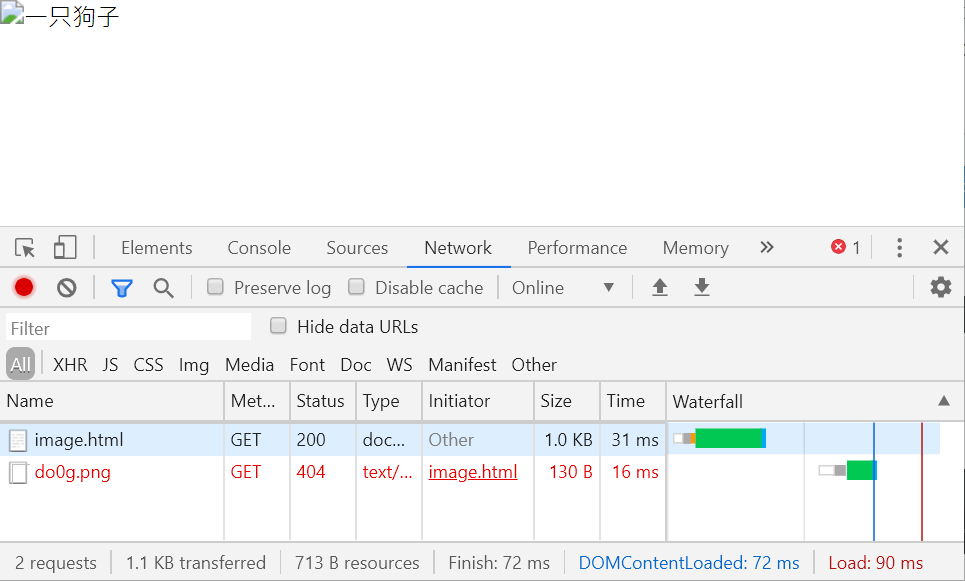
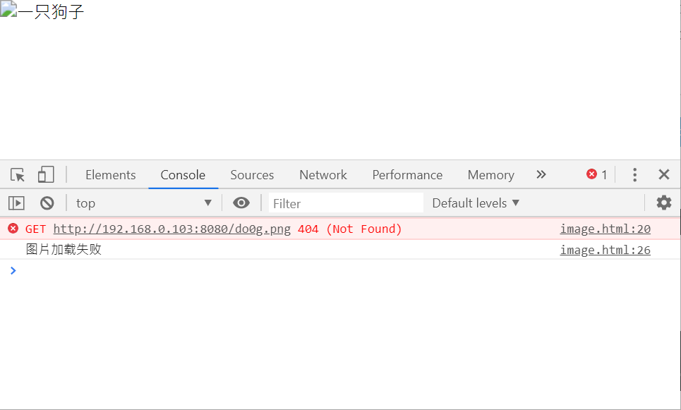
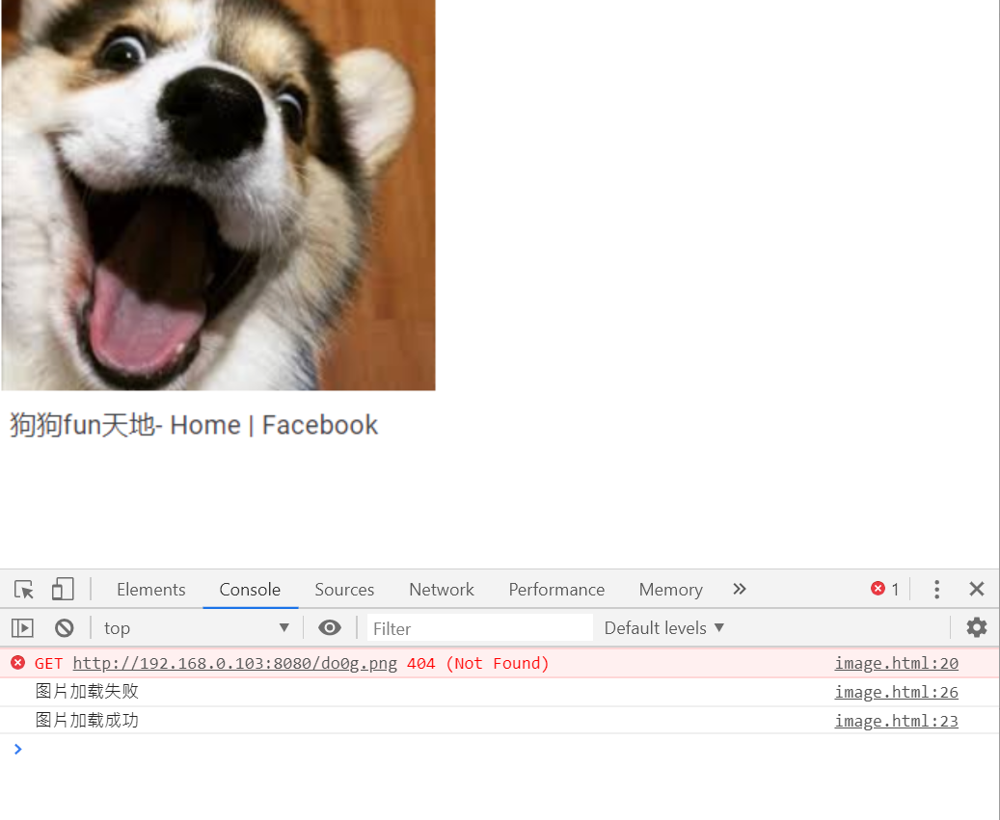
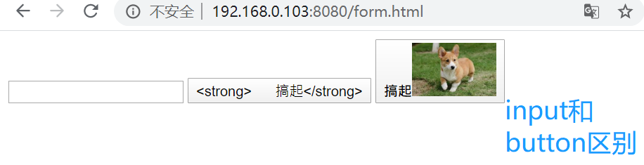

本篇博客主要为课堂笔记，主要在VSCode中操作，项目文件夹名为html-demo-2，以下内容分为四个主要部分：
1. `a` 标签的用法
2. `table` 标签的用法
3. `img` 标签的用法
4. 其他标签知识          
<br>
<br> 
# 一、[a标签](https://developer.mozilla.org/zh-CN/docs/Web/HTML/Element/a)的用法
`<a>` 元素（或称锚元素）可以创建通向其他网页、文件、同一页面内的位置、电子邮件地址或任何其他 URL 的超链接。      
- ### 属性
  - href（hyper reference）//超级引用，超链接；
  - target //指定在何处显示链接的资源；
  - download //下载网页，网站不一定支持；
  - rel=noopener    
<br>
>***工具小链接:终端安装两个可以预览网页的工具***               
>1. http-server
安装：`yarn global add http-server`  //可以输入网址看到页面；     
=> `http-server . -c-1` or  `http-server -c-1` ,可以缩写为`hs -c-1`。//c是缓存，c=-1表示不要缓存。=> 运行之后出现四个网址，随便点一个，打开后加上网页具体路径就可以预览。若要手机预览四个地址的话，需要和电脑同一个wifi。   
**注意：永远不要双击打开html。**    
用http server来打开预览，这样可以避免遇到很多奇奇怪怪的bug。     
>2. parcel
安装：`yarn global add parcel`
=>`parcel a.href.html`
=>出现一个地址，点击预览                              
<br> 
- ### 作用
  - 跳转外部页面
  - 跳转内部锚点
  - 跳转到邮箱或电话等      
<br >
## 1.a的href的取值
包含超链接指向的 URL 或 URL 片段。   
URL 片段是哈希标记（#）前面的名称，哈希标记指定当前文档中的内部目标位置（HTML 元素的 ID）。URL 不限于基于 Web（HTTP）的文档，也可以使用浏览器支持的任何协议。例如，在大多数浏览器中正常工作的`file:`、`ftp:`和`mailto：`。  
<br>   
> **注意:** 可以使用 `href="#top"` 或者` href="#" `链接返回到页面顶部。这种行为是 HTML5 的特性。         
<br>      
- ### 网址
  - https://google.com
  - http://google.com
  - //google.com   //*无协议的网址，最高级，推荐使用。会自动选择适用http还是https，不会报错。在vscode中写上这个网址，打开这个网址，打开开发者工具，点击network下的preserve log，然后再打开超链接。*
- ### 路径        
  - `/a/b/c`以及`a/b/c`  &nbsp; //*都可以写，他们是http中的根目录是html-demo-2；*
  - `index.html`以及`./index.html` &nbsp; //*直接写这两个都能在当前目录找到*
- ### 伪协议        
  - javascript:代码;   
  //*`javascript:alert(1); `      
    打开网页点击可直接运行这串代码。常用来写一个什么都不做的a标签。*
  - mailto:邮箱  &nbsp;&nbsp;//*发邮件*
  - tel:手机号
- ### id     
   `href=#xxx` &nbsp;&nbsp; //*a里面加一个id，跳转到指定的标签*             
<br>
## 2.a的target取值
target属性指定在何处显示链接的资源。取值为标签（tab），窗口（window），或框架（iframe）等浏览上下文的名称或其他关键词。
- ### 内置名字/关键词     
  - `_self`: **当前页面加载**，即当前的响应到同一HTML 4 frame（或HTML5浏览上下文）。此值是默认的，如果没有指定属性的话。
  - `_blank`: **新窗口**打开，即到一个新的未命名的HTML4窗口或HTML5浏览器上下文
  - `_parent`: 加载响应到当前框架的HTML4父框架或当前的HTML5浏览上下文的**父浏览**上下文。如果没有parent框架或者浏览上下文，此选项的行为方式与 _self 相同。
  - `_top`: IHTML4中：加载的响应成完整的，原来的窗口，取消所有其它frame。 HTML5中：加载响应进入**顶层浏览**上下文（即，浏览上下文，它是当前的一个的祖先，并且没有parent）。如果没有parent框架或者浏览上下文，此选项的行为方式相同_self。    
<br>
> **注意：** 使用target时，考虑添加 `rel="noopener norefferrer" `以防止针对 window.opener API 的恶意行为。      
<br>                      
- ### 程序员命名     
  - window的name &nbsp;&nbsp;//用同一个窗口打开不同页面;
  - iframe的name                  
<br>

- ### iframe标签         
  内嵌窗口，已经很少使用，还有些老系统在用。新的前端用ajax。谷歌不允许别人用iframe执行它。          
<br>

## 3.a的download
- ### 作用             
  下载页面
- ### 问题               
  不是所有浏览器都支持，尤其是手机浏览器可能不支持。           <br>         
<br>
# 二、[table标签](https://developer.mozilla.org/zh-CN/docs/Web/HTML/Element/table)的用法  
`table` 元素表示表格数据——即通过二维数据表表示的信息。
```
<table>
    <thead>
        <tr>
            <th colspan="2">The table header</th>
        </tr>
    </thead>
    <tbody>
        <tr>
            <td>The table body</td>
            <td>with two columns</td>
        </tr>
    </tbody>
    <tfoot>我定义了一组表格中各列的汇总行
    </tfoot>
</table>
```              
<br>     

- ## 相关标签      
  -  `<thead>`元素定义了一组定义表格的列头的行；
  - `<tbody>` //tr没有指定放在哪里时，默认放在tbody里；
  - `<tfoot>` 定义了一组表格中各列的汇总行；
  - `<tr>` (table row)元素定义表格中的行。 Those can be a mix of <td> and <th> elements.
  - `<td>` (table data)元素定义了一个包含数据的表格单元格。It participates in the table model.
  - `<th>` 表头             
<br>
- ## 相关的样式
  - table-layout //auto根据内容计算表格宽度/fixed
  - border-collapse //边框合并
  - border-spacing //border之间的距离为0      
<br> 
<br>
# 三、[img标签](https://developer.mozilla.org/zh-CN/docs/Web/HTML/Element/img)的用法    
```
 
```
图片//src=source，将一个图片截图后加到VSCode中，命名为a.png,直接引用src="a.png"。   
1. ### `` 元素的基本用法   
- `src` 属性是必须的，它包含了你想嵌入的图片的文件路径。
- `alt` 属性包含一条对图像的文本描述，这不是强制性的。但对可访问性而言，它难以置信地有用——屏幕阅读器会将这些描述读给需要使用阅读器的使用者听，让他们知道图像的含义。如果由于某种原因无法加载图像，普通浏览器也会在页面上显示`alt`属性中的备用文本：例如，网络错误、内容被屏蔽或链接过期时。
1. ### 作用       
- 发出`get`请求，展示一张图片。                
3. ### 属性                   
- alt               
alternative &nbsp;//可选的，在图片加载失败时提示alt里的内容；
- height/width &nbsp;//只写height或者只写width，另一个会自适应，如果两个皆规定了一个值，图片会变形。
> **注意：千万不要让图片变形！**
- src &nbsp;//图片地址
4. ### 事件
- onload/onerror &nbsp;//监听图片是否加载成功，成功调用onload，失败调用onerror。这样可以在图片加载失败后进行挽救。
```
<body>
    
    <script>
      xxx.onload = function() {
        console.log("图片加载成功");
      };
      xxx.onerror = function() {
        console.log("图片加载失败");
        xxx.src = "/404.png";
      };
    </script>
</body>
```                           
- 图片加载成功，打开开发者工具，打开console如下：
        

- 图片加载失败后显示文字“一只狗子”如下：
                

- 图片加载失败，打开开发者工具，打开console如下：
     

- 图片加载失败后，跳转到404.png，挽回显示如下： 

          
1. ### 响应式
  - `max-width:100%`
```
<style>
    * {
        margin: 0;
        padding: 0;
        box-sizing: border-box;
      }
    img {
        max-width: 100%;
        }
</style>
```
6. ### 可替换元素
- 考试可能会问，被问概率30%。        
<br>
<br>
# 四、其他标签知识
## 1. [form标签](https://developer.mozilla.org/zh-CN/docs/Web/HTML/Element/form) 表单
表示了文档中的一个区域，此区域包含有交互控制元件，用来向 Web 服务器提交信息。
- ### 作用
  发get或post请求，然后刷新页面
- ### 属性
  - action &nbsp;//后跟一个路径，请求的页面网址；
  - autocomplete &nbsp;//是否自动填充on/off；
  - method &nbsp;//请求的方法get或post；
  - target &nbsp;//提交到那个页面，那个页面应该刷新。
- ### 事件
  - onsubmit //提交时会触发；要触发，需要写上`type="submit"`
> input和button的区别是input里不能有任何东西，但是button里可以有，strong甚至img都可以。 下面是html以及对应的ouput。     
```
<input type="submit" value="<strong>
      搞起</strong>" />
      <button type="submit">
        <strong>搞起</strong>
      </button>
```


## 2. [input标签](https://developer.mozilla.org/zh-CN/docs/Web/HTML/Element/input)     
用于为基于Web的表单创建交互式控件，以便接受来自用户的数据; 可以使用各种类型的输入数据和控件小部件，具体取决于设备和user agent。           
- ### 作用   
  让用户输入内容
- ### 属性
  - 类型type
    - **button** //无缺省行为按钮。
    - **checkbox**//复选框。必须使用 value 属性定义此控件被提交时的值。使用 checked 属性指示控件是否被选择。也可以使用 indeterminate 指示复选框在一种不确定状态（大多数平台上，显示为一条穿过复选框的水平线）。让他们拥有同一个name，会是一组多选。
    - email //HTML5 用于编辑 e-mail 的字段。 合适的时候可以使用 :valid 和 :invalid CSS 伪类。
    - **file**//此控件可以让用户选择文件。使用 accept 属性可以定义控件可以选择的文件类型。要想上传多个文件，加一个multiple。
    - **hidden** //不显示在页面上的控件，但它的值会被提交到服务器。S自动填写一些内容，如id，字符串。
    - number //HTML5 用于输入浮点数的控件。
    - **password** //一个值被遮盖的单行文本字段。使用 maxlength 指定可以输入的值的最大长度。
    - **radio** //单选按钮。必须使用 value 属性定义此控件被提交时的值。使用checked 必须指示控件是否缺省被选择。在同一个“单选按钮组”中，所有单选按钮的 name 属性使用同一个值； 一个单选按钮组中是，同一时间只有一个单选按钮可以被选择。
    - search //HTML5用于输入搜索字符串的单行文本字段。换行会被从输入的值中自动移除。
    - submit //用于提交表单的按钮。
    - tel //HTML5 用于输入电话号码的控件；换行会被自动从输入的值中移除A，但不会执行其他语法。可以使用属性，比如 pattern 和 maxlength 来约束控件输入的值。恰当的时候，可以应用 :valid 和 :invalid CSS 伪类。
    - text  //单行字段；换行会将自动从输入的值中移除。
  - 其他 name/autofocus/checked/disabled/maxlength/pattern/value/placeholder
- ### 事件       
  - onchange //当用户输入改变时触发
  - onfocus //鼠标聚焦在上面的时候触发
  - onblur //鼠标离开的时候触发  
- ### 验证器         
  HTML5新增功能  //加上required就必须要填写        
<br>
## 3. 其他输入标签
  - select+option     
  select表示一个控件，提供一个选项菜单。可在option里写上value="",1,2;
  ```
  <label for="pet-select">Choose a pet:</label>
  <select name="pets" id="pet-select">
    <option value="">--Please choose an option--</option>
    <option value="dog">Dog</option>
    <option value="cat">Cat</option>
    <option value="hamster">Hamster</option>
    <option value="parrot">Parrot</option>
    <option value="spider">Spider</option>
    <option value="goldfish">Goldfish</option>
  </select>
  ```
  - textarea //`style="resize:none"`防止尺寸变动。
  - label //表示用户界面中某个元素的说明。
- ### 注意事项      
  - 一般不监听input的click事件
  - form里面的input要有name
  - form里要放一个`type=submit`才能触发submit事件

## 4. 其他标签
- video              
  用于在HTML或者XHTML文档中嵌入媒体播放器，用于支持文档内的视频播放。
- audio   
   元素用于在文档中表示音频内容。 `<audio>` 元素可以包含多个音频资源， 这些音频资源可以使用 src 属性或者`<source>` 元素来进行描述； 浏览器将会选择最合适的一个来使用。对于不支持`<audio>`元素的浏览器，`<audio>`元素也可以作为浏览器不识别的内容加入到文档中。
- canvas     
  可被用来通过脚本（通常是JavaScript）绘制图形。比如，它可以被用来绘制图形，制作图片集合，甚至用来实现动画效果。你可以(也应该)在元素标签内写入可提供替代的的代码内容，这些内容将会在在旧的、不支持`<canvas>`元素的浏览器或是禁用了JavaScript的浏览器内渲染并展现。
- svg   
  可缩放矢量图形（Scalable Vector Graphics，SVG），是一种用于描述基于二维的矢量图形的，基于 XML 的标记语言。本质上，SVG 相对于图像，就好比 HTML 相对于文本。

- ### 注意事项
  - 这些标签的兼容性一定要查看文档
  - 后续会在JS课程里专门讲这些标签


-end-

参考资料：         
1.https://developer.mozilla.org/zh-CN/docs/Web/HTML/Element
2.饥人谷方方课程

声明：原创作品，转载请注明出处，侵权必究。
