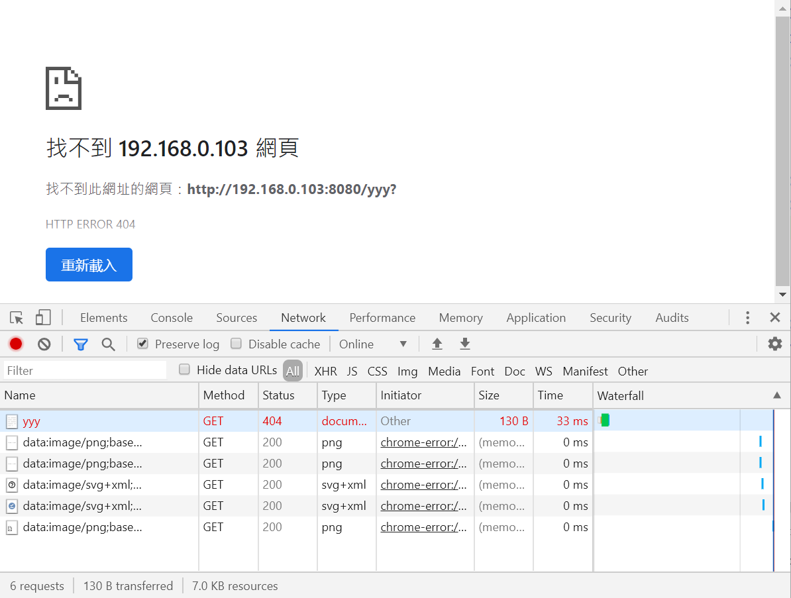

1 和 2 是在 posts 中建了一个文件夹“图片测试”，然后将图片加到文件夹里，再建一个 md 文件。 x 只在 posts 中有，y 在 posts 和 static/images/中,c 只在 static 中。  
结论，两种方法可行 AB：  
**1.formxxx.png  
2.y posts formyyy.png  
6.y static/../formyyy.png  
7.static/../c.png**  
**A:建一个以文章名称命名的文件夹，里面放一个 index.md 文件，图片等文件就也放当前文章这个文件夹里面即可。  
B:在 static/images 中加入图片，然后图片 src 写 static/../c.png 即可。**

---

测试结果如下：

1.x posts formxxx.png:

2.y posts formyyy.png:

3.y static/../../../../static/images/formyyy.png :

4.y /public/images/formyyy.png :

5.y static/../../../../themes/ananke/static/images/gohugo-default-sample-hero-image.jpg :

6.y static/../formyyy.png :

7.c static/../c.png (本地预览不了):

8.c static/../../../../static/images/c.png :
  
9.c static/images/c.png :
  
如果是要插入图片的，就建一个以文章名称命名的文件夹，里面放一个 index.md 文件，图片等文件就也放当前文章这个文件夹里面即可。

这样，既能保证本地编辑是能实时渲染，也能保证最终呈现是正确无误的，而工作环境仅需要考虑当前文件夹，不用翻来覆去地寻找和核对。

而如果是不需要插入图片的文章，依然还是一个以文章名称命名的 .md 文件即可。

如果需要转移文章到新的目录，或者是寻找一个图片，都无需担心太多，直接操作，以文件夹为管理核心即可。

这便是我的内容资源管理方案，很不错了。

废话这么多，还是不如放一个文件夹路径图来的有视觉感：
├── posts  
│ ├── 2018-04-13-搜索服务的.md  
│ ├── 2018-04-18-小到 Hugo.md  
│ ├── 2018-04-26-图片测试  
│ │ ├── formxxx.png  
│ │ ├── formyyy.png  
│ │ └── index.md  
│ ├── 2018-05-02-12345.md  
│ └── 2018-05-03-Hugo 的文件管理方案.md

感谢
https://www.isyin.cn/post/2018-05-03-hugo-%E7%9A%84%E6%96%87%E4%BB%B6%E7%AE%A1%E7%90%86%E6%96%B9%E6%A1%88/
